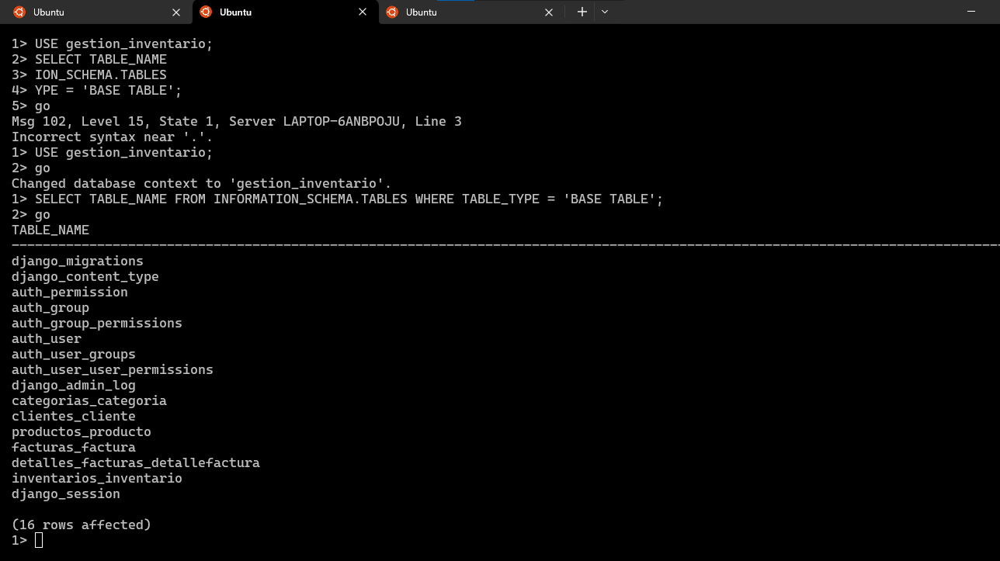
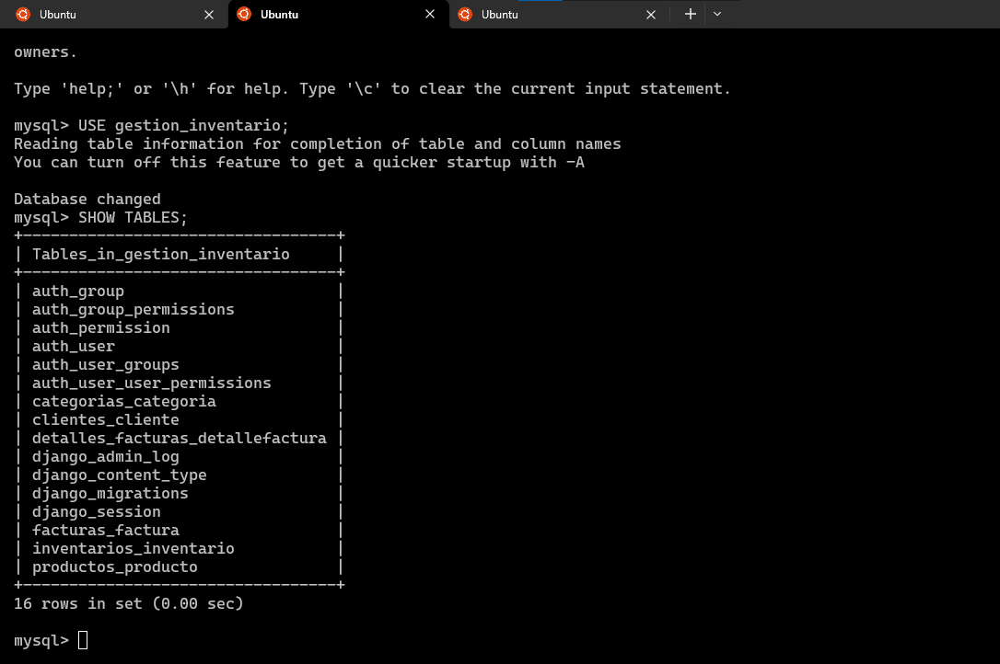

# Proyecto de Inventario

Este proyecto muestra la integración de un sistema de inventario desarrollado con Django y su conexión a diferentes bases de datos, incluyendo Oracle, SQL Server, PostgreSQL y MySQL. A continuación, se presenta una colección de tablas de prueba generadas mediante migraciones de Django para cada una de estas bases de datos.

Tablas Generadas con Django en Bases de Datos
A continuación, se muestran ejemplos visuales de las migraciones y las tablas generadas con Django en diferentes entornos de bases de datos:

## Oracle
Archivos de prueba que muestran las tablas generadas mediante migraciones de Django en Oracle.

## SQL Server
Archivos de prueba que muestran las tablas generadas mediante migraciones de Django en SQL Server.

## PostgreSQL
Archivos de prueba que muestran las tablas generadas mediante migraciones de Django en PostgreSQL.

## MySQL
Archivos de prueba que muestran las tablas generadas mediante migraciones de Django en MySQL.

### Configuración de Conexión a Bases de Datos en el Proyecto de Inventario
Para conectar el proyecto a tu base de datos preferida, sigue estos pasos:

Dirígete al archivo settings.py, ubicado en gestion_inventario/gestion_inventario/settings.py.
En este archivo, encontrarás la configuración DATABASES = {}. Para establecer la conexión, comenta o desactiva la configuración actual y añade los detalles específicos de tu base de datos.
Repite el proceso para cada base de datos que desees utilizar, ajustando la configuración en settings.py según los requisitos de cada motor de base de datos.

## Vista previa del software 

### Integrantes

Yoner De Jesus Isaza Vides 
Dairo Alfonso Arcia Macea

UNIVERSIDAD DE LA GUAJIRA
